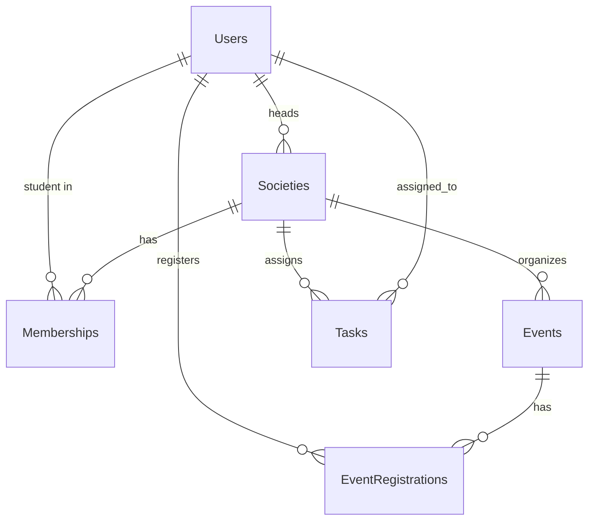

# Societies Management System

A desktop application for managing university student societies using C# Windows Forms and SQL Server.

## Features

### Student Features
- User registration and login
- Browse available societies
- Apply for society membership
- Join multiple societies
- View upcoming events
- Register for events
- View membership status
- View event registrations

### Society Head Features
- Create and manage society profiles
- Approve/reject membership requests
- Manage member lists
- Create, update, and cancel events
- Assign tasks to members
- Generate reports on members and events

### Admin Features
- Manage all student accounts
- Create, approve, suspend, or delete societies
- Monitor all society activities
- Approve event requests
- Generate university-wide reports

## Database Schema

The database schema is defined in `database_schema.sql`. It includes tables for Users, Societies, Memberships, Events, EventRegistrations, and Tasks.

## ERD

The Entity Relationship Diagram is shown below:



## Setup Instructions

1. Install SQL Server and create a database named `SocietiesManagementDB`.
2. Run the SQL script in `database_schema.sql` to create the tables and indexes.
3. Update the connection string in `DBHelper.cs` if necessary (currently set to `Server=localhost;Database=SocietiesManagementDB;Trusted_Connection=True;`).
4. Build and run the application using `dotnet run`.

## Requirements

- .NET 9.0
- SQL Server
- Windows OS

## Building the Project

```bash
dotnet build
```

## Running the Project

```bash
dotnet run
```

On first run, the application will automatically create the database and tables if they do not exist, and insert a default admin user.

### Default Admin Credentials
- Email: admin@university.edu
- Password: admin123

Use these credentials to log in as admin and start managing the system.

## Notes

- Passwords are hashed using SHA256.
- The application uses Windows Forms for the UI.
- All database operations are handled through the `DBHelper` class.